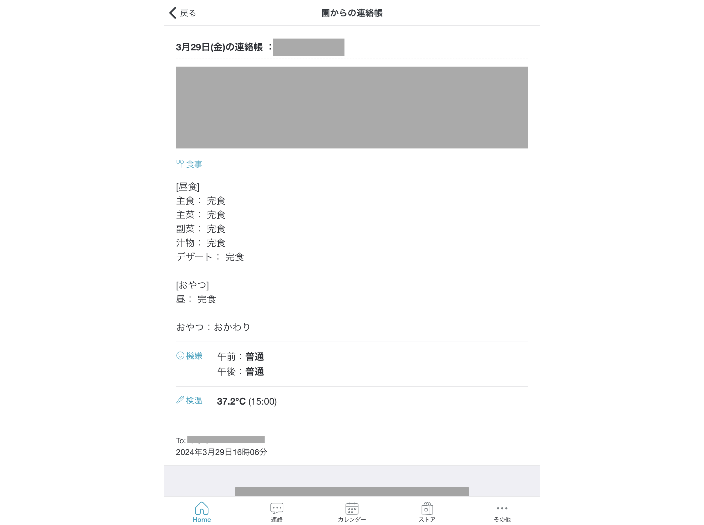

# Extraction from Codmon

This tool is to extract daily information from [codmon](https://www.codmon.com/)

# Setup

## Setup virtual environment

```sh
# Create virtual environment
python -m venv .venv

# activate
source .venv/bin/activate

# install modules
pip install -r requirements.txt
```

## Environmental variables

For this tool to automatically login into [codmon page](https://parents.codmon.com/menu) and do the scraping tasks, there are two information you have to provide with.  
For this purpose, you should create `.env` and provide your own credentials.

```.env
CODMON_EMAIL=<email_to_login_codmon>
CODMON_PASSWORD=<password_to_login_codmon>
```

## Run

```sh
python src/scraping.py
```

## What is the scraping task like?

If the scraping work is successful, the tool generates png file which captures daily reports with the file name being `yyyy年mm月dd日.png`.

